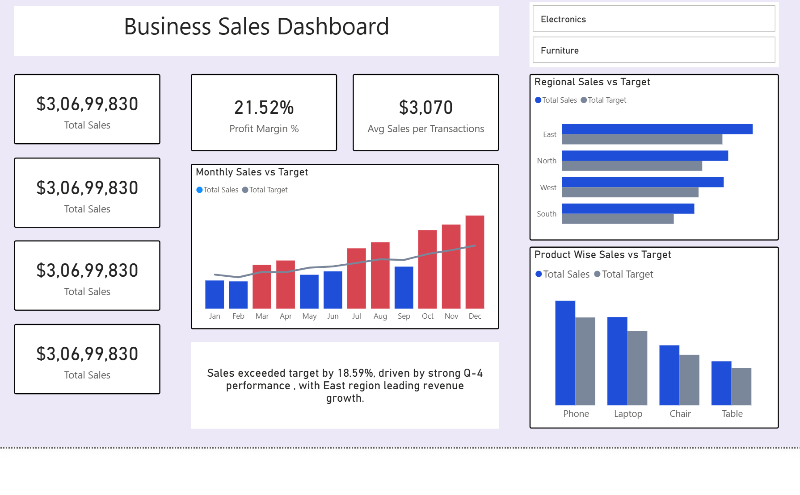

# 📊 Sales Dashboard

Dashboard that shows **Sales vs Target** comparison and
dynamic business insights using **DAX**.

---

## 🚀 Features

- Sales vs Target analysis
- Target variance and variance %
- Dynamic narrative insight generation
- Identifies:
  - Top performing quarter
  - Selected product category
  - Best region by sales

---

## 📷 Dashboard Preview




## 🧠 Dynamic Business Insight (DAX)

```DAX
Insight Text =
VAR _varianceValue = [Target Variance]
VAR _variancePCT = DIVIDE(_varianceValue, [Total Target])

VAR _varianceText =
    IF(
        _variancePCT >= 0,
        "Sales exceeded target by " & FORMAT(_variancePCT, "0.00%"),
        "Sales fell short of target by " & FORMAT(_variancePCT, "0.00%")
    )

VAR _topQuarter =
    MAXX(
        TOPN(
            1,
            SUMMARIZE(
                'Calendar',
                'Calendar'[Qtr],
                "SalesValue", [Total Sales]
            ),
            [SalesValue],
            DESC
        ),
        'Calendar'[Qtr]
    )

VAR _categorySelected =
    IF(
        HASONEVALUE(Dim_Product[Category]),
        " in " & SELECTEDVALUE(Dim_Product[Category]),
        ""
    )

VAR _topRegion =
    MAXX(
        TOPN(
            1,
            SUMMARIZE(
                'Dim_Region',
                'Dim_Region'[Region],
                "SalesValue2", [Total Sales]
            ),
            [SalesValue2],
            DESC
        ),
        Dim_Region[Region]
    )

RETURN
    _varianceText &
    ", driven by strong " & _topQuarter & " performance" &
    _categorySelected &
    ", with " & _topRegion & " region leading revenue growth."


```
---

📌 **Example Insight Output**

Sales exceeded target by 5.42%, driven by strong Q3 performance in Electronics, with West region leading revenue growth.

🛠 Tools & Technologies

Power BI

DAX

Star Schema Data Model

Interactive Filters & Slicers

📈 **Use Case**

Ideal for:

Sales performance reviews

Executive dashboards

Automated storytelling in BI reports
